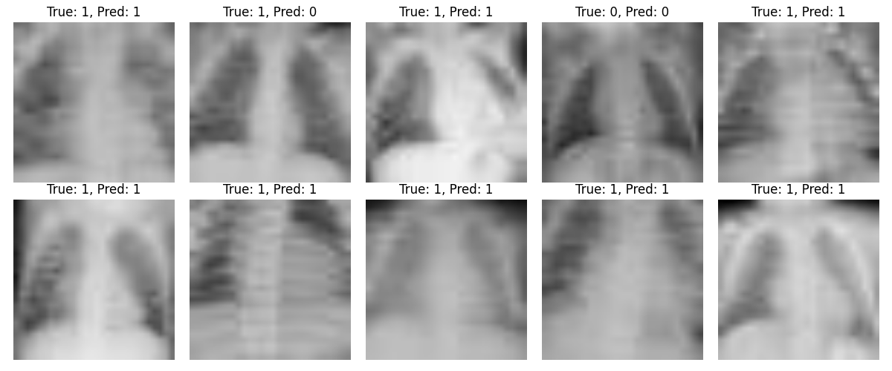

# Pneumonia Detection using InceptionV3

This project fine-tunes a pretrained InceptionV3 model on the PneumoniaMNIST dataset to detect pneumonia from chest X-ray images.

---

## ✅ Dataset
- Dataset name: PneumoniaMNIST
- Contains grayscale X-ray images labeled as NORMAL or PNEUMONIA.
- We resized images to 128×128 and converted them to RGB to match InceptionV3 input requirements.

---

## ⚙️ How to run

Open Command Prompt and run:

```bash
cd Desktop\pneumonia_project
venv\Scripts\activate
pip install -r requirements.txt
python train.py
python train_mobilenet.py
```

## 📊 Evaluation Metrics
|   Metric |                                                                                    Why |
| -------: | -------------------------------------------------------------------------------------: |
| Accuracy |                                 Simple and easy to interpret; % of correct predictions |
|      AUC |           Measures model's ability to separate classes; robust for imbalanced datasets |
| F1‑score | Balances precision and recall; better reflects performance when classes are imbalanced |

---

## 📈 Results (on validation set)
Below are the model's performance metrics after training on PneumoniaMNIST:

| Model        | Accuracy | AUC  | F1‑score |
|-------------:|--------:|----:|--------:|
| InceptionV3  | ~93.5%  | 0.87 | 0.96    |
| MobileNetV2  | ~89%    | 0.93 | 0.95    |

> MobileNetV2 is smaller and faster, but had slightly lower accuracy.

---

## 🖼 Example predictions

Below are some validation images with predicted vs true labels:

**InceptionV3:**


**MobileNetV2:**


---

## 🧪 Notes on reproducibility

Deep learning models often give slightly different results each time due to randomness in:
- Data splitting (train/test)
- Weight initialization
- Data augmentation

To make results consistent and reproducible, we fixed random seeds in both `train.py` and `train_mobilenet.py`:

```python
np.random.seed(42)
tf.random.set_seed(42)
random.seed(42)
```

---
## ⚙️ Hyperparameter choices

| Parameter     | Value    | Why                                                                |
|--------------:|---------:|--------------------------------------------------------------------:|
| Image size    | 128×128  | Keeps enough detail and faster training                             |
| Batch size    | 32       | Standard size, fits in memory                                       |
| Epochs        | 5        | Enough to see convergence, avoids overfitting                       |
| Learning rate | 0.0001   | Small value for stable fine-tuning of pretrained model              |

---

## 📦 Model files
After training, the models are saved as:
- `pneumonia_inceptionv3.keras`
- `pneumonia_mobilenetv2.keras`

These files can be loaded later for predictions without retraining.
